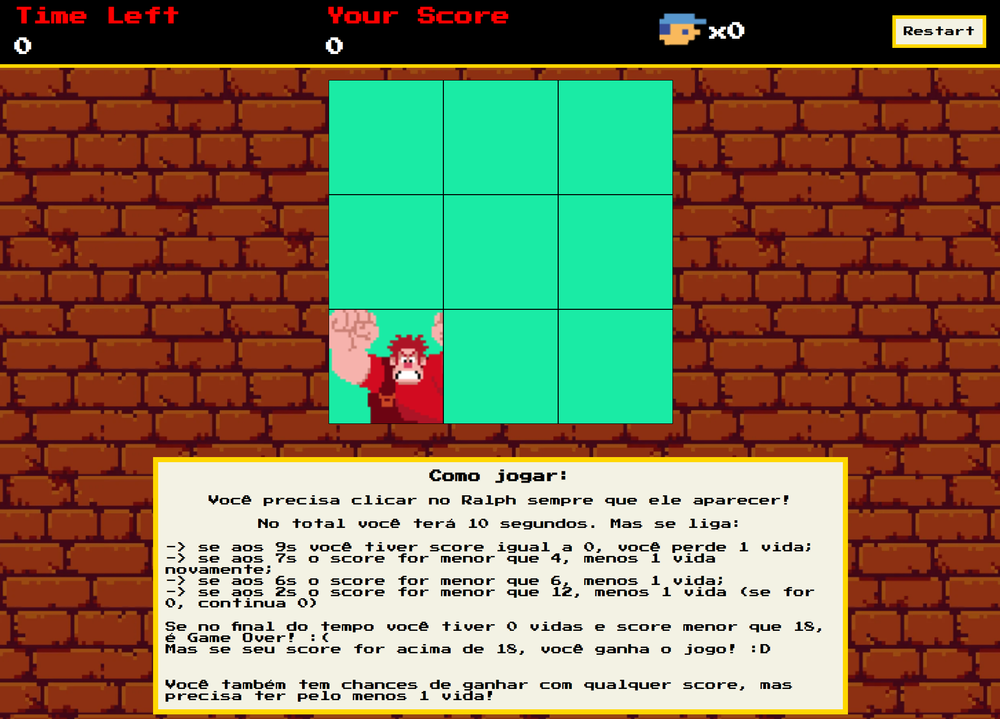

# Game "Detona Ralph"

In this repository you can find an exciting short game made as part of a [Digital Innovation One - DIO](https://www.dio.me/en) bootcamp about principals of Game Development in JavaScript.

### Technologies used

- HTML and CSS
- JavaScript
- Sprites and images

### Additional Functionalities

At the end of the lesson I had the basic functionalities of the game:

- Ralph randomly showing in any of the 9 squares;
- a score being recorded as the player clicks on Ralph;
- and the countdown.

As an exercise I thought of how to make it a bit more competitive. I created some **rules** that as the time decreases there will be some "checkpoints" and the player needs a certain amout of points to avoid losing lives! I also added a **Restart Button** so the user doesn't need to reload the page when the game ends, and the **Instructions** (in PT-BR).

### How to play 🕹️

You'll have 10 seconds in total to click on Ralph everytime it appears in any of the squares. Can you make 20 points? 😃

**How to win?**  
Finish the game with 1 or more lives, so the score won't matter. However, there will be some "checkpoints" where you'll lose lives if you don't reach a certain score:

1. At 9s your score has to be greater than 0, otherwise you lose 1 life. 🥲
2. At 7s the score has to be greater than 4, otherwise you lose another life. 🤨
3. At 6s your score has to be greater than 6, otherwise you lose another life. 😢
4. Finally at 2s the score has to be greater than 14, otherwise you lose one more life. 😨  
   If at this point there's no lives left, the game still continues and you still have chances to win!

Now, if you end up without lives, you can still win if you reach a score equal or greater than 18. 😌

### Credits

This game was developed during an awesome lesson by [Felipe Aguiar](https://github.com/felipeAguiarCode) of a [DIO](https://www.dio.me/en) bootcamp.
